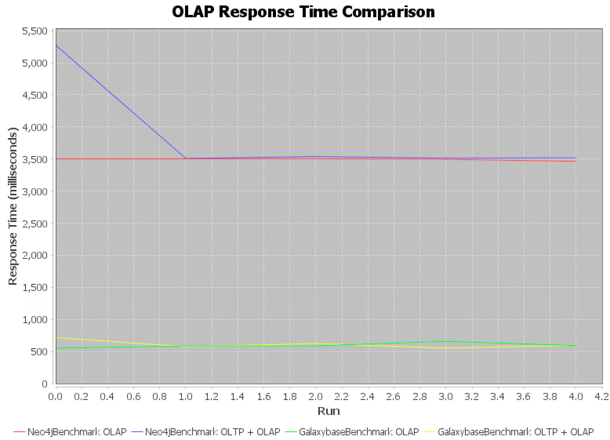

# HTAPBench: A Benchmark for Graph Database Transaction Performance in HTAP Scenarios

## Overview

This project aims to develop a comprehensive benchmark testing framework for graph databases, specifically focusing on their performance in Hybrid Transactional/Analytical Processing (HTAP) environments. The framework assesses the transactional and analytical capabilities of graph databases, providing valuable insights into their performance under diverse workloads. The research is centered on addressing the requirements of transaction processing (OLTP) and complex analysis (OLAP), offering a targeted reference for real-world applications.

## Custom Graph Database Benchmark
This project extends the GraphDatabaseBenchmark interface to facilitate custom benchmark testing for alternative graph databases.

- Create a new class that extends the GraphDatabaseBenchmark abstract class.
```java
public class CustomBenchmark extends GraphDatabaseBenchmark {
// Implement benchmark test methods
}
```
- Customize benchmark tests within the implemented class based on your requirements.

- Add and run the benchmark tests using the provided framework.
```java
    GraphDatabaseBenchmark customBenchmark = new CustomBenchmark();
    Driver.compareDatabases(neo4jBenchmark, galaxybaseDatabaseBenchmark, customBenchmark);
```

## Getting Started
### Prerequisites
Environment
- Java 11
- Maven 3.0.0

Install the Neo4j and Galaxybase graph database in advance.
```properties
Neo4j: https://neo4j.com/
Galaxybase: https://www.galaxybase.com/
```

Load data for Neo4j and Galaxybase.
```properties
data: https://snap.stanford.edu/data/higgs-twitter.html
```


### Installation

You should install this HTAP benchmark project.

```bash
# Clone the repository
git clone https://github.com/yourusername/graph-database-benchmark.git
cd graph-database-benchmark

# Build the project
mvn clean install

```

### Usage

```bash
java -jar target/graph-database-benchmark.jar
```

### Expected Results
Generate the charts when the benchmark has finished.




